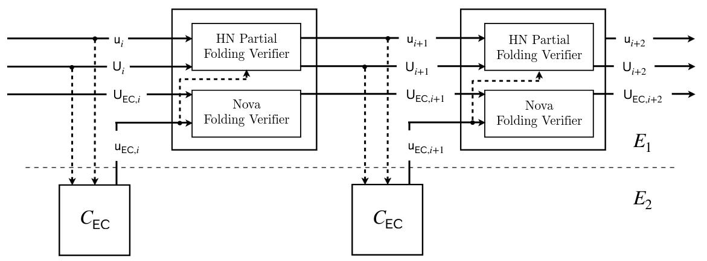
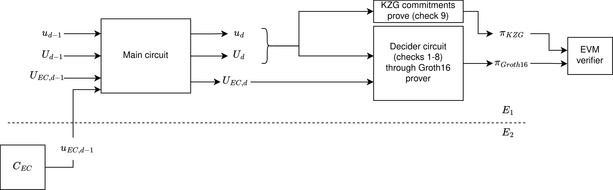

# Decider for Onchain Verification

**Overview**: This section describes the approach for the *Decider* (compressed SNARK / final proof) in order to be able to **verify the Nova+CycleFold proofs onchain (in Ethereum's EVM)**.

> **Warning**: This section, as the rest of Sonobe, is experimental. The approach described in this section is highly experimental and has not been audited.

## Context
At the final stage of the Nova+CycleFold folding, after $n$ iterations, we have the committed instances $\{u_n, U_n, U_{EC,n} \}$ and their respective witnessess.

*Diagram source: CycleFold paper ([https://eprint.iacr.org/2023/1192.pdf](https://eprint.iacr.org/2023/1192.pdf)). In the case of this document $n=i+2$, so $u_{i+2} = u_n$, $U_{i+2}=U_n$, $U_{EC,i+2}=U_{EC,n}$.*

 

We work on a cycle of curves composed by $E_1$ and $E_2$, where $E_1.F_r = E_2.F_q$ and $E_1.F_q=E_2.F_r$.
We will use $F_r$ to refer to $E_1.F_r=E_2.F_q$, and $F_q$ to refer to $E_1.F_q=E_2.F_r$.
The main circuit constraint field is $F_r$, and $C_{EC}$ circuit constraint field is $F_q$.

Since the objective is to verify the proofs on Ethereum, we set $E_1$=BN254 and $E_2$=Grumpkin. Thus, $F_r$ is the scalar field of the BN254.

The $u_n$ and $U_n$ contain: $\{ \overline{E} \in E_1, \overline{W} \in E_1, u \in F_r, x \in F_r^{|io|} \}$

And $U_{EC,n}$ contains: $\{ \overline{E} \in E_2, \overline{W} \in E_2, u \in F_q, x \in F_q^{|io|} \}$

## The Decider approach
The decider proof is computed once, and after all the folding has taken place. Our aim is to be able to verify this proof in the Ethereum's EVM.

The prover computes $(U_{n+1}, W_{n+1}, \overline{T}) = NIFS.P((U_n, W_n), (u_n, w_n))$

The *Decider Circuit* verifies in its R1CS relation over $F_r$ the following checks:

1. correct RelaxedR1CS relation of $U_{n+1}, W_{n+1}$ of the AugmentedFCircuit
2. check that $u_n.\overline{E}=0$ and $u_n.u=1$
3. check that $u_n.x_0 = H(n, z_0, z_n, U_n)$ and $u_n.x_1 = H(U_{EC,n})$
4. Pedersen commitments verification of $U_{EC,n}.\{ \overline{E}, \overline{W} \}$ with respect $W_{EC,n}$ (the witness of the committed instance)
(where $\overline{E},\overline{W} \in E_2$, this check is native in $F_r$)
 *The following check is done non-natively (in $F_r$):*
5. check the correct RelaxedR1CS relation of $U_{EC,n}, W_{EC,n}$ of the CycleFoldCircuit (this is non-native operations and with naive sparse matrix-vector product blows up the number of constraints
6. Check correct computation of the KZG challenges
$$c_E = H(\overline{E}.\{x,y\}),~~c_W = H(\overline{W}.\{x,y\})$$
which we do through in-circuit Transcript.
7. check that the KZG evaluations are correct
    - $eval_W == p_W(c_W)$
    - $eval_E == p_E(c_E)$
where $p_W, p_E \in \mathbb{F}[X]$ are the interpolated polynomials from $W_{i+1}.W,~ W_{i+1}.E$ respectively.
8. check that the given NIFS challenge $r$ is indeed well computed. This challenge is then used outside the circuit by the Verifier to compute NIFS.V obtaining $U_{i+1}$

Additionally we would have to check (outside of the circuit):

9. Commitments verification of $U_{n+1}.\{ \overline{E}, \overline{W} \}$ with respect $W_{n+1}$ (where $\overline{E}, \overline{W} \in E_1$)
10. check $NIFS.V(r, U_n, u_n, \overline{T}) \stackrel{?}{=} U_{n+1}$

The check 7 would be too expensive if using Pedersen commitments verification in-circuit (non-natively), so we changed these commitments from Pedersen to KZG, and then verify the KZG commitments outside of the circuit and directly onchain.

The prover would generate a *Groth16* proof over BN254 for this *Decider Circuit*, which can later be verified onchain in the EVM together with the KGZ commitments of check 7 and check 8.

In this way, the final proof to be verified onchain would be:

- a Groth16 proof of the checks 1-8
- the KZG proofs of the check 9
- the NIFS.V (check 10), which relates the inputs of checks 1-8 and check 9

 

<u>The RelaxedR1CS checker circuit</u>

The *"correct RelaxedR1CS relation"* (used in check 1) is checked by the gadget proposed by [Nalin Bhardwaj](https://twitter.com/nibnalin/), which is a R1CS circuit that checks the RelaxedR1CS relation, [more details here](https://github.com/privacy-scaling-explorations/sonobe/issues/19).

The idea is that we check in a R1CS circiut the RelaxedR1CS relation ($Az \circ Bz - uCz -E=0$). Note that this approach has a blowup of `3x` with respect to the original circuit number of constraints `x` (when using sparse representation of the matrices).

### Circuit costs
> Note: the number of constraints written in this section is the current values that we have, which we aim to reduce in future iterations.

<u>Estimated costs of the full decider-onchain circuit:</u>

*(`x` is the number of constraints of the circuit that we're folding, and the AugmentedFCircuit takes ~52k constraints)*

1. $U_{n+1}$ relation: `3(x+52k)`
2. $u_n$ check: `<1000`
3. $u_n.x$ hash check: `2634`
4. Pedersen check of $U_{EC,n}$ commitments (native): `<5M` both commitments (including the inputs allocations). This is a couple of native MSMs of <1500 elements each one)
5. $U_{EC,n}$ relation (non-native): `5.1M`
6. Check correct computation of the KZG challenges: `7708`
7. check that the KZG evaluations are correct
8. check that the given NIFS challenge $r$ is indeed well computed

Total: 3 * (x + 52_252) + 1000 + 2634 + 4_967_155 + 5_146_236 + 7708

eg: for a circuit of `500k` constraints the decider circuit would take approximately `11.7M` constraints.

As can be seen, most of the costs come from the Pedersen commitments verification and the $U_{EC,n}$ relation
