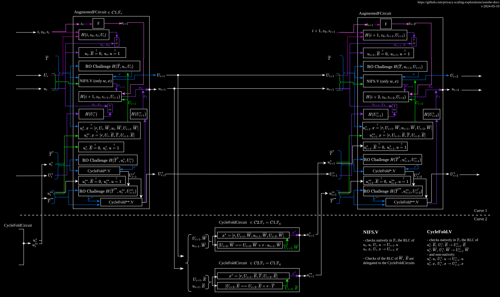

# Nova + CycleFold

[CycleFold](https://eprint.iacr.org/2023/1192.pdf) improves the usage of the cycle of curves proposed in [Nova](https://eprint.iacr.org/2021/370.pdf).

*CycleFold applied to HyperNova, src: [https://eprint.iacr.org/2023/1192.pdf](https://eprint.iacr.org/2023/1192.pdf)*

 

We use a concrete version of the CycleFold approach applied to Nova.

The following image provides a description of the main Nova circuit and CycleFold circuit over a couple of steps, implemented at [nova/circuits.rs](https://github.com/privacy-scaling-explorations/folding-schemes/blob/main/folding-schemes/src/folding/nova/circuits.rs) and [nova/cyclefold.rs](https://github.com/privacy-scaling-explorations/folding-schemes/blob/main/folding-schemes/src/folding/nova/cyclefold.rs).

