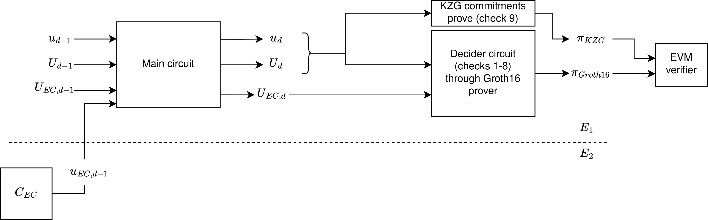

# Decider

## Decider prove

Two options:

- onchain (Ethereum's EVM) mode
- offchain mode

Once we have been folding our circuit instances, we can generate the *"final proof"*, the Decider proof.


#### Onchain Decider



Generating the final proof (decider), to be able to verify it in Ethereum's EVM:

```rust
type DECIDER = Decider<
    Projective,
    Projective2,
    CubicFCircuit<Fr>,
    KZG<'static, Bn254>,
    Pedersen<Projective2>,
    Groth16<Bn254>, // here we define the Snark to use in the decider
    NOVA,              // here we define the FoldingScheme to use
>;

let mut rng = rand::rngs::OsRng;

// prepare the Decider prover & verifier params for the given nova_params and nova instance. This involves generating the Groth16 and KZG10 setup
let (decider_pp, decider_vp) = DECIDER::preprocess(&mut rng, &nova_params, nova.clone()).unwrap();

// decider proof generation
let proof = DECIDER::prove(rng, decider_pp, nova.clone()).unwrap();

```

As in the previous sections, you can find a full examples with all the code at [sonobe/examples](https://github.com/privacy-scaling-explorations/sonobe/tree/main/examples).

## Decider verify
We can now verify the Decider proof

```rust
// this is the same that we defined for the prover
type DECIDER = Decider<
    Projective,
    Projective2,
    CubicFCircuit<Fr>,
    KZG<'static, Bn254>,
    Pedersen<Projective2>,
    Groth16<Bn254>,
    NOVA,
>;

let verified = DECIDER::verify(
    decider_vp, nova.i, nova.z_0, nova.z_i, &nova.U_i, &nova.u_i, proof,
)
.unwrap();
assert!(verified);
```

In the Ethereum Decider case, we can generate a Solidity smart contract that verifies the proofs onchain. More details in the [next section](solidity-verifier.md).
